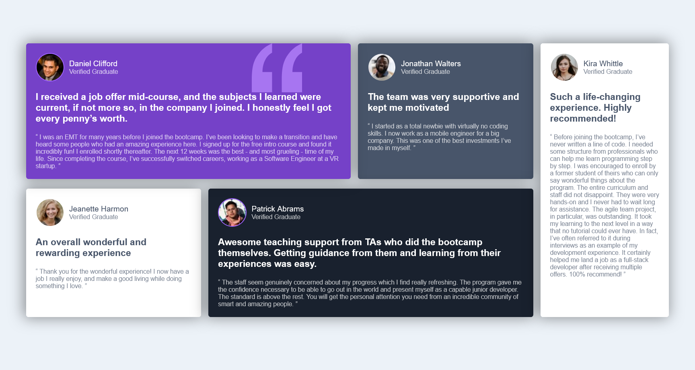
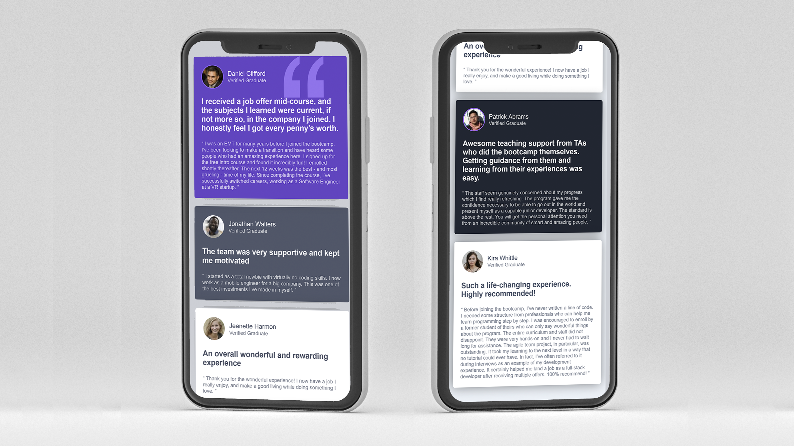

# Testimonials grid section  Challenge - solution

Here's my solution to the [Testimonials grid section challenge on Frontend Mentor](https://www.frontendmentor.io/challenges/testimonials-grid-section-Nnw6J7Un7). Utilizing Flexbox and media queries, I developed a responsive grid layout that elegantly showcases testimonials across various screen sizes. 

## Table of contents

- [Overview](#overview)
  - [The challenge](#the-challenge)
  - [Screenshot](#screenshot)
  - [Links](#links)
- [My process](#my-process)
  - [Built with](#built-with)
  - [What I learned](#what-i-learned)
  - [Useful resources](#useful-resources)
- [Author](#author)
- [Acknowledgments](#acknowledgments)

## Overview

### The challenge


- Develop the given testimonial grid section design. 

- Users should be able to view the optimal layout for the site depending on their device's screen size.

### Screenshot

- Design preview of the Testimonials grid section for desktop



- Design preview of the Testimonials grid section for Mobile




### Links

- Solution URL: [Click here](https://github.com/sayeedmunees/testimonials-grid-section)
- Live Site URL: [Click here](https://sayeedmunees.github.io/testimonials-grid-section/)

## My process

### Built with

- Semantic HTML5 markup
- CSS custom properties
- CSS Flexbox
- Mobile-first workflow

### What I learned

In addition to utilizing Flexbox, I also explored the power of media queries to further enhance the responsiveness of my web design across various devices. Media queries allowed me to tailor specific CSS rules based on the characteristics of the user's device, such as screen width, height, and orientation. Here's an example showcasing the use of flexbox and media queries:

```css

@media (min-width: 576px) {
   .header {
    display: flex;
    align-items: center;
    margin-bottom: 20px;
    position: relative;
    z-index: 3;
    }
}
```

### Useful resources

- [Frontend Mentor](https://www.frontendmentor.io/challenges/testimonials-grid-section-Nnw6J7Un7) - Got this challenge from Frontend Mentor, along with workfiles like required designs, icons and other files.

- [MDN Docs](https://developer.mozilla.org/en-US/) - Here's another useful resourse, which is the MDN documentation itself. It helped me to find, understand and use code snipped that i didn't knew before.


## Author

- GitHub - [@sayeedmunees](https://github.com/sayeedmunees)

## Acknowledgments

I'd like to give a special shoutout to Full Stack Zack from YouTube, whose content served as a great inspiration and provided valuable assistance throughout this project. His insights and tutorials were instrumental in helping me navigate the challenges and find solutions.